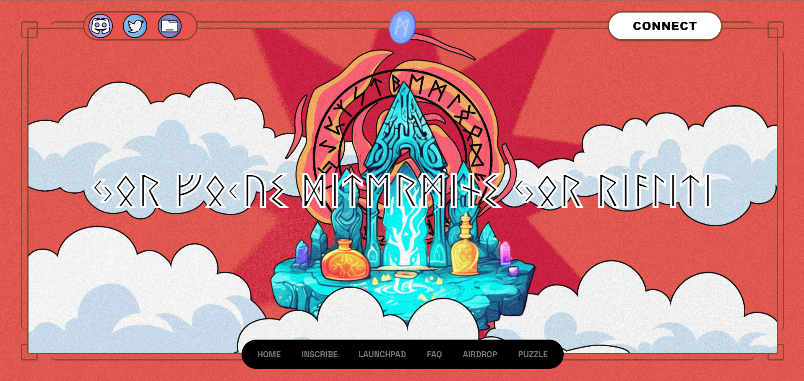

# About-Me

  <strong>Experienced and Passionate Blockchain Developer with 6 years of experience in Bitcoin, Ethereum and Solana!!!</strong>
   
  I am responsible for designing, developing, and maintaining decentralized applications (dApps) and blockchain systems. my work involves writing smart contracts, managing the blockchain architecture, ensuring security, and integrating blockchain protocols with existing 
  systems on ETH, BTC and SPL. And I always stay updated on the latest trends and advancements in blockchain technology to create scalable and efficient solutions in various industries, such as finance, supply chain, and gaming.
  Let's building awesome projects in Web3 and go to the Moon!!!.

<h3><a href="https://app.metarunes.io/" target="_blank">Meta Rune</a> [Bitcoin]</h3>

The fully decentralized protocol for launching new ideas. An all-in-one Incubation Hub with a full-stack Defi platform based on the RUNES ▣protocol. META provide exclusive services including IDO/INO Launchpad, Yield farming, NFT Minting / Auction , Airdrop campaigns.

META operates on top of the Bitcoin blockchain and is designed to offer maximum value to consumers and institutions.

META platform uses the HODL Model for the purpose of profit-sharing with $META holders , helping users to access Runes platforms in the easiest, safest, and most cost-effective way. META is the most convenient bridge to connect users and application products together.

Additionally META offers a RUNES inscribing service that allows users to personalize their Runes tokens with custom inscriptions. This service involves selecting the Runes token, specifying the quantity and number of inscriptions, inputting the receiving address, selecting a fee rate, choosing a payment method, completing the payment, and waiting for the inscription process to be finalized.

With the possibility of inscribing on certain Sats and Attributes.

<h3><a href="https://www.ordinals.fun/" target="_blank">Odinals Fun</a> [Litecoin]</h3>

Ordinals Fun is Litecoin marketplace where to buy and sell your favorite Ordinals NFTs and LTC20s.

- Litemap : Verified .Litemap inscriptions will be displayed here

- LTC-20 : Coming soon

- NFTs : Only listed Collections will be displayed here

- Others : All non-listed &/or non-verified inscriptions will be displayed here

- History : Wallet Inscribe & Trading history

<h3><a href="https://www.ordinals.fun/" target="_blank">Brc20 Marketplace</a> [Bitcoin]</h3>

<strong>Top BRC-20 Coins by Market Cap</strong>
There are Top BRC-20 Coins listed by Market Cap and It involves some projects on BTC like Bitradio, and Rune protocol etc...

- BRC-20 is an experimental standard for fungible tokens on the Bitcoin blockchain.
- The Taproot and Ordinals protocol made the BRC-20 standard possible.
- BRC-20 tokens unlock new capabilities for the Bitcoin network, such as their use in DeFi protocols and blockchain applications.
