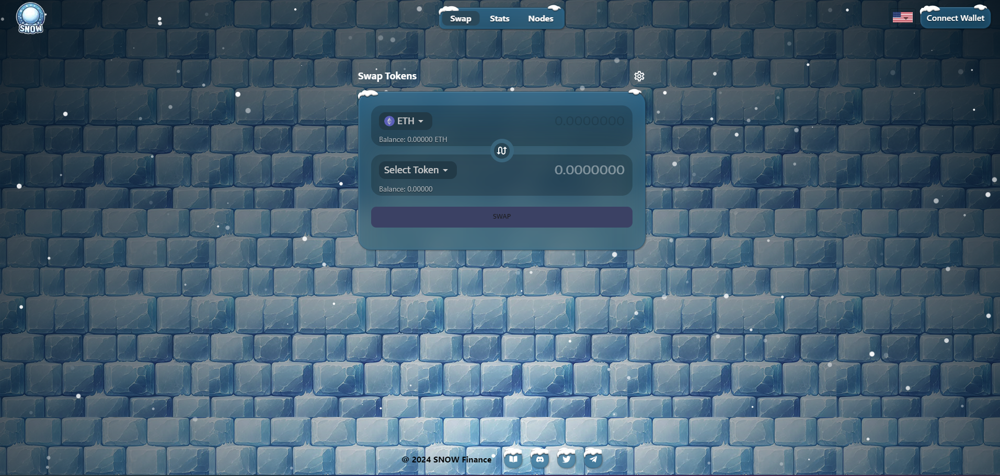

# About-Me

  <strong>Experienced and Passionate Blockchain Developer with 6 years of experience in the Blockchain industry (Bitcoin, Ethereum, and Solana)!!!</strong>
   
  I am responsible for designing, developing, and maintaining decentralized applications (dApps) and blockchain systems. my work involves writing smart contracts, managing the blockchain architecture, ensuring security, and integrating blockchain protocols with existing 
  systems on ETH, BTC and SPL. And I always stay updated on the latest trends and advancements in blockchain technology to create scalable and efficient solutions in various industries, such as finance, supply chain, and gaming.
  Let's building awesome projects in Web3 and go to the Moon!!!.

<h3><a href="https://app.metarunes.io/" target="_blank">Meta Rune</a> [Bitcoin]</h3>

The fully decentralized protocol for launching new ideas. An all-in-one Incubation Hub with a full-stack Defi platform based on the RUNES ▣protocol. META provide exclusive services including IDO/INO Launchpad, Yield farming, NFT Minting / Auction , Airdrop campaigns.

META operates on top of the Bitcoin blockchain and is designed to offer maximum value to consumers and institutions.

META platform uses the HODL Model for the purpose of profit-sharing with $META holders , helping users to access Runes platforms in the easiest, safest, and most cost-effective way. META is the most convenient bridge to connect users and application products together.

Additionally META offers a RUNES inscribing service that allows users to personalize their Runes tokens with custom inscriptions. This service involves selecting the Runes token, specifying the quantity and number of inscriptions, inputting the receiving address, selecting a fee rate, choosing a payment method, completing the payment, and waiting for the inscription process to be finalized.

With the possibility of inscribing on certain Sats and Attributes.

<h3><a href="https://www.ordinals.fun/" target="_blank">Odinals Fun</a> [Litecoin]</h3>

Ordinals Fun is Litecoin marketplace where to buy and sell your favorite Ordinals NFTs and LTC20s.

- Litemap : Verified .Litemap inscriptions will be displayed here

- LTC-20 : Coming soon

- NFTs : Only listed Collections will be displayed here

- Others : All non-listed &/or non-verified inscriptions will be displayed here

- History : Wallet Inscribe & Trading history

<h3><a href="https://www.ordinals.fun/" target="_blank">Brc20 Marketplace</a> [Bitcoin]</h3>

<strong>Top BRC-20 Coins by Market Cap</strong>

- BRC-20 is an experimental standard for fungible tokens on the Bitcoin blockchain.
- The Taproot and Ordinals protocol made the BRC-20 standard possible.
- BRC-20 tokens unlock new capabilities for the Bitcoin network, such as their use in DeFi protocols and blockchain applications.

<h3><a href="https://www.ordinalscouncil.com/" target="_blank">Ordinals Council</a> [Bitcoin]</h3>

<strong><i>$CNCL</i></strong>
 
- The biggest and broadest utility tool, providing downstream benefits for all future products. Created to concrete shared incentives between The Council and the Community

<strong><i>Candidate PFP Ordinals</i></strong>

- Community access badge. Hold it to become a Candidate. Candidates can become Council Members through Proof of Work.

<strong><i>Toshipad</i></strong>

- A gigantic, cross-crypto monument to the gravity of the Godchain BTC. An entry for all NFT projects to cross over onto BTC and find fertile soil.
  Want to launch on Ordinals? TOSHIPAD offers seed funding, incubation, a professional support team, marketing and partnerships and a world class dev team. We’re here to streamline your launch.

<h3><a href="https://bitradio.netlify.app/" target="_blank">Bitradio</a> [Bitcoin]</h3>

Bitradio is the special idea of inscribing audio files to bitcoin blocks so you can inscribe the audio files to bitcoin blocks and you can listen to them you inscribed.

<h3><a href="https://blockworld.netlify.app/" target="_blank">Block World</a> [Bitcoin]</h3>

Block world is bitcoin inscribing service to inscribe inscriptions to every block you wanna inscribe.

<h3><a href="https://gem-pro.vercel.app/" target="_blank">Gem Base</a> [Ethereum]</h3>

Gem Base, a yield farm gearing up for a Stealth Launch on the BASE blockchain. Powered by the GEM token, it brings lucrative opportunities through its GEM/ETH LP pool + single staking for GEM.

With a focus on sustainable growth, Gem Base aims to provide a rewarding yield farming experience.

The standout feature is the GEM/ETH LP pool, offering a high APR to attract and retain investors and ensuring a steady flow of liquidity.

By excluding blue-chip tokens, Gem Base safeguards against large player liquidity drains, establishing a fair and sustainable environment for all investors.

<h3><a href="https://snow-yield-farming.vercel.app/" target="_blank">Snow Bank</a> & <a href="https://snow-dex.vercel.app/" target="_blank">Snow DEX</a> [Ethereum]</h3>

<strong>Objective</strong>: Initiate the presale of SNOW tokens and yield earning Snow Bank NFT's, offering early access to investors and community members.

<strong>Hype</strong>: Engage with early adopters, gather feedback, and build anticipation for the official launch.

<strong>Beta Testing</strong>: Ensuring the durability of the Snow Bank platform, fine-tuning all technical and operational aspects.

<strong>Launch of Snow Bank</strong>: Snow Bank goes live - marking the start of yield farming SNOW on Ethereum.
SNOW/ETH LP Pool: Zap into the high APR SNOW/ETH LP pool along with exclusive staking options for SNOW and SNOW NFTs.
Community Engagement: Strengthen community ties through interactive sessions, AMAs, and continuous support.

Announce the upcoming presale for Snow Bank's Decentralized Exchange (DEX).
Presale Goals: Aim to attract broader participation, laying the financial and community foundation for the DEX.
Preparation for DEX Launch: Finalize the development and testing of the DEX, ensuring a seamless and secure experience for users.
DEX Launch: The official launch of our cross-chain DEX.

The expansion into a DEX marks a pivotal chapter in our journey. By building this platform, Snow Bank is not just diversifying our services but also reinforcing our commitment to creating a robust, user-centric DeFi ecosystem. This step will lay the groundwork for Snow Bank's future innovations and continued success in the DeFi space.

<h3><a href="https://pulse-yield-farm.vercel.app/" target="_blank">PWild Base</a> [Ethereum]</h3>

Yield Farming token staking on Pulse chain.
